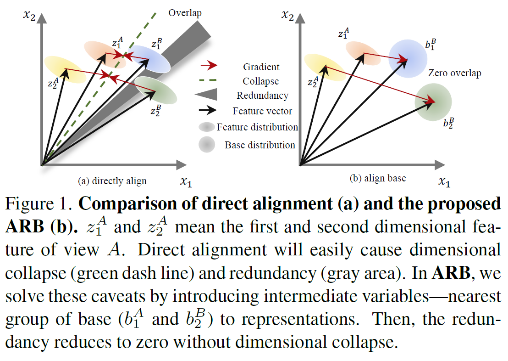

# Align Representations with Base: A New Approach to Self-Supervised Learning

Code of CVPR 22 paper "[Align Representations with Base: A New Approach to Self-Supervised Learning](sherrylone.github.io/../../pages/assets/CVPR22_ARB.pdf)"

[](https://github.com/Sherrylone/Align_Representation_with_Base/blob/main/framework.png)

This paper presents a negative-free contrastive learning method ARB. Different from previous contrative learning methods, which align the representations of different views. ARB firstly proposes find the closest base of the represetations and align the representations with the searched base.

[](https://github.com/Sherrylone/Align_Representation_with_Base/blob/main/illustration.png)

To pre-train the encoder on CIFAR-10 and CIFAR-100, run:
```
python main.py --epochs 1000 --dataset cifar10 (cifar100)
```
The config `--swap` is used for shuffling the feature to reduce the redundancy. The config `--group` is used for dividing the feature dimension into several groups to reduce the computation.

For ImageNet-100, train the ARB in one node with several GPUs. Run: 
```
python main.py --data /imagenet100/ --epochs 400 --swap true -- method group
```
You should implement the Dataset class by yourself.

The results are:

| Method | CIFAR-10 | CIFAR-100 | ImageNet-100 |
| :-----| ----: | :----: | :----: |
| VICReg | 90.07 (99.71) | 68.54 (90.83) | 79.22 (95.06) |
| SwAV | 89.17 (99.68) | 64.67 (88.52) | 74.28 (92.84) |
| W-MSE | 88.18 (99.61) | 61.29 (87.11) | 69.06 (91.22) |
| SimCLR | 90.74 (99.75) | 65.39 (88.58) | 77.48 (93.42) |
| Barlow Twins | 89.57 (99.73) | 69.18 (91.19) | 78.62 (94.72) |
| ARB | 92.19 (99.89) | 69.57 (91.77) | 79.48 (95.51) |

For ImageNet pretraining, we implement on several nodes (distributed training). Run:
```
python main.py --data /imagenet/ --epochs 1000 --swap
```
We can get 73.1 top-1 accuracy and 91.5 top-5 accuracy. The evaluation log is [here](https://github.com/Sherrylone/Align_Representation_with_Base/blob/main/ImageNet/eval.log)

If you use ARB as baseline, please cite our paper:
```
@inproceedings{
zhang2022align,
title={Align Representations with Base: A New Approach to Self-Supervised Learning},
author={Shaofeng Zhang and Lyn Qiu and Feng Zhu and Junchi Yan and Hengrui Zhang and Rui Zhao and Hongyang Li and Xiaokang Yang},
booktitle={The IEEE / CVF Computer Vision and Pattern Recognition Conference},
year={2022}
}
```
